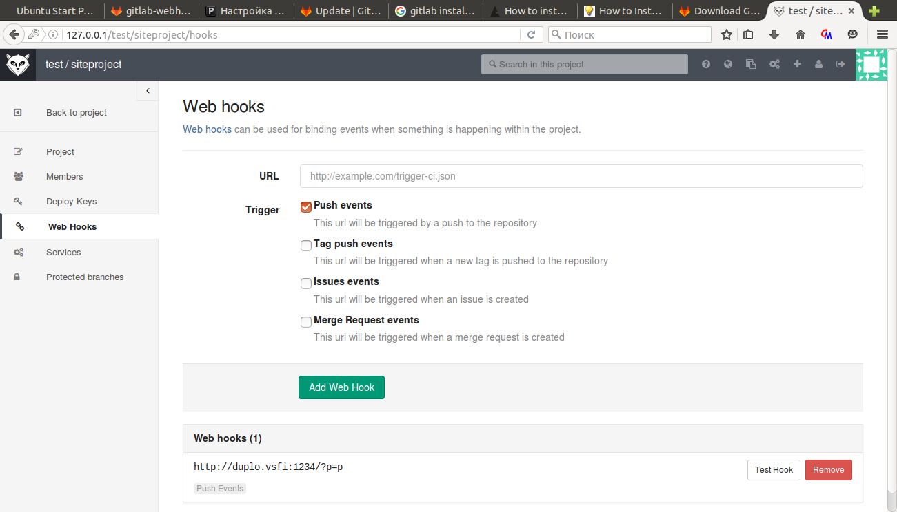

#git сервер
---
### Разворачивание GitLab

Установка из deb пакета, все зависимости подтягиваются и ставятся автоматически.
```bash
dpkg -i gitlab-ce-XXX.deb
```
Измененить external_url в файле /etc/gitlab/gitlab.rb и выполнить
```bash
sudo gitlab-ctl reconfigure
```
Далее нужно добавить пользователей и проект сайта
___
### Hooks

Добавляем web hook на событие push

___
### Перехват hooks

Запускаем python скрипт на веб-сервере
```python
import web
import os

urls = ('/.*', 'hooks')

app = web.application(urls, globals())

class hooks:
    def POST(self):
	print os.system("cd /usr/local/nginx && git pull")
        return 'OK'

if __name__ == '__main__':
    app.run()
``` 
