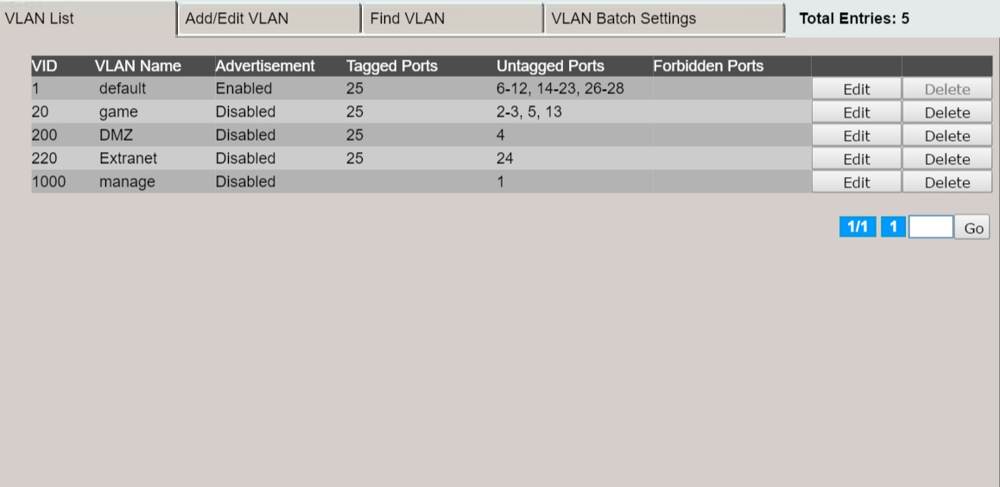

## VSFI Writeup

by Duplo team


---

###1 задание - VLAN

___

###VLAN

Настраиваем 4 vlan
* untagged ports(1)+tagged uplink  id 1  - default
* untagged ports(2)+tagged uplink  id 20 - gamenet
* untagged ports(1)+tagged uplink  id 200- dmz
* untagged ports(1)+tagged uplink  id 220- extranet 


___

###Router interfaces


---

###2 задание - Внешний IP, DHCP, NAT

___

### Добавление адресов на интерфейсы

```bash
ip address add address=<ip> interface=<interface>
```


___

### Настройка dhcp

```bash
ip dhcp-server setup
```


___

### Настройка NAT

```bash
ip firewall nat add chain=srcnat action=masquerade out-interface=ether1 log=no 
```


---
### 3 задание - DNS

___
### Настройка DNS

```bash
apt-get install bind9
vim /etc/bind/named.conf.local
vim /etc/bind/named.conf.options
```
allow-recursion { any; };


___

### Конфиг зон

```bash
vim /etc/bind/db.duplo
```


___

### обратная зона

```bash
vim /etc/bind/db.172
```
 


___

### локальная зона

```bash
vim /etc/bind/db.local
``` 


---
### 4 задание - OSPF

___

### Настройка OSPF

 Создаем OSPF процесс:

```bash
[Duplo@r2] > rou ospf instance add name=duploOSPF router-id=192.168.1.20 
redistribute-connected=as-type-1 disabled=no
```

___

 Создаем  новую OSPF зону:
```bash
[Duplo@r2] > rou ospf area add name=area1 area-id=1.1.1.1 
instance=duploOSPF comment=lol disabled=no
```

___

Задаем сеть, в которой будет работать OSPF:
```bash
[Duplo@r2] > rou ospf net add network=192.168.1.0/24 area=area1
```


---

### 5 задание - Сайт на nginx

___

###Статический сайт

Генератор статических сайтов - mkdocs

Генерация нового проекта и сборка
```bash
mkdocs new siteproject
mkdocs build
```

Пример контента
</img>
___

###nginx
Собрать с модулями, которые необходимы для следующих заданий

```bash
apt-get purge nginx
sudo apt-get install build-essential libpcre3 libpcre3-dev libssl-dev
wget http://nginx.org/download/nginx-1.7.5.tar.gz
wget https://github.com/arut/nginx-rtmp-module/archive/master.zip
...
./configure --with-http_ssl_module --with-http_stub_status_module --add-module=../nginx-rtmp-module-master
make
sudo make install
```
___

###Конфигурация nginx

```bash
vim /usr/local/nginx/conf/nginx.conf
/usr/local/nginx/sbin/nginx -s stop
/usr/local/nginx/sbin/nginx
```
В секцию http
```text
    server {
        listen       80;
        server_name  duplo.vsfi;
	
        location / {
            root   html;
            index  index.html index.htm;
        }


        error_page   500 502 503 504  /50x.html;
        location = /50x.html {
            root   html;
        }

    }
```

---
###6 задание - стрим


___
###Видеовещание
```bash
apt-get isntall ffmpeg
```
Правим nginx.conf:
```text
rtmp {
    server {
            listen 1935;

            application live {
                    live on;
            }
    }
}
```
___
###трансляция на домене
Используем отдельный домен video.<>.vsfi

/usr/local/nginx/video/index.html:
```html
<div style='text-align:center;margin-bottom:20px;'>
   <object id="live_api" width="450" height="300" type="application/x-shockwave-flash" data="http://cameras.inetcom.ru/js/flowplayer/flowplayer.commercial-3.2.16.swf" name="live_api" xmlns="" xmlns:xi="http://www.w3.org/2001/XInclude">
      <param value="true" name="allowfullscreen">
      <param value="always" name="allowscriptaccess">
      <param value="high" name="quality">
      <param value="#000000" name="bgcolor">
      <param value="transparent" name="wmode">
      <param value="config={'canvas':{'background':'none'},'clip':{'url':'myStream.spd','live':true,'provider':'rtmp'},'plugins':{'rtmp':{'url':'http://cameras.inetcom.ru/js/flowplayer/flowplayer.rtmp-3.2.12.swf','netConnectionUrl':'rtmp://duplo.vsfi/live'},'hddn':{'url':'http://cameras.inetcom.ru/js/flowplayer/flowplayer.rtmp-3.2.12.swf','netConnectionUrl':'rtmp://duplo.vsfi/live'},'controls':{'backgroundGradient':'none','backgroundColor':'transparent','scrubber':false,'time':false}},'showErrors':false,'playerId':'live','playlist':[{'url':'myStream.sdp','live':true,'provider':'rtmp'}]}" name="flashvars">
   </object>
</div>
```
___
###интеграция на сайт
/usr/local/nginx/html/index.html:
```html
<script src="https://code.jquery.com/jquery-latest.js"></script>
<div id="block"></div>
<script type="text/javascript">$('#block').load('http://video.duplo.vsfi/');</script>
```
___
###стриминг
```bash
ffmpeg -y -loglevel warning -i /dev/video0 -threads 2 -vcodec libx264 -f flv rtmp://duplo.vsfi/live/myStream.sdp
```
/dev/video0 - вебкам
Можно в качестве инпута (-i) подавать видеофайл либо другой стрим

---
###7 задание - статистика nginx

___
###Редактирование конфига страницы
/usr/local/nginx/conf/nginx.conf

секция server{...}
```text
location /status { 
	    #enable CORS
	    add_header 'Access-Control-Allow-Origin' "$http_origin";
            add_header 'Access-Control-Allow-Credentials' 'true';
            add_header 'Access-Control-Allow-Methods' 'GET, POST, PUT, DELETE, OPTIONS';
	    add_header 'Access-Control-Allow-Headers' 'Accept,Authorization,Cache-Control,Content-Type,DNT,If-Modified-Since,Keep-Alive,Origin,User-Agent,X-Mx-ReqToken,X-Requested-With';
	    stub_status;
        }
```
___
###Объединение статистики на новом домене
/usr/local/nginx/stat/index.html:
```html
<body>

    <h2>Статистика по duplo.vsfi</h2>
    <pre id="duplo"></pre>
    <script type="text/javascript">$('#duplo').load('http://duplo.vsfi/status');</script>

    <h2>Статистика по video.duplo.vsfi</h2>
    <pre id="video"></pre>
    <script type="text/javascript">$('#video').load('http://video.duplo.vsfi/status');</script>
    
</body>
```
---
###8 задание - furwall


___

Настройка firewall обусловлена написанием правил. 
Каждое правило делится на 2 части: указатель на то, 
какой трафик мы фильтруем и действие, которое к нему применяется.
___

Правила можно объединять в цепочки. Существует три предопределенные 
цепочки, которые не могут быть удалены:

* input- цепь используется для фильтраии пакетов, идущих из внешней сети во внутреннюю сеть.
* forward- цепь используется для обработки пакетов, проходящих через роутер.
* output- цепь используется для обработки пакетов, направленных с роутера и проходящих через одну из цепочек. 
___

Основными действиями в firewall являются:

* Разрешить передачу пакета "Accept"
* Запретить передачу пакета "Drop"
* Переход к цепочкам "Jump"
___

### Примеры правил firewall

Пример добавления правила:

```bash
[Duplo@r2] > ip firewall filter add chain=drop 
action=drop comment="drop everything nahyu"  
```
___

Пример цепочек:


---
###9 задание - Joy Mortal Kombat
___
###Scorpion wins


---
###10 задание - https


___
###Создание сертификата, dhparam, ключей
```bash
openssl genrsa -des3 -out server.key 2048
openssl rsa -in server.key -out server.key.insecure
mv server.key server.key.secure
mv server.key.insecure server.key
openssl req -new -key server.key -out server.csr
openssl x509 -req -days 365 -in server.csr -signkey server.key -out server.crt
```
___
###Редактирование конфига nginx
/usr/local/nginx/conf/nginx.conf:
```text
server {
        listen       80;
        server_name  duplo.vsfi;
 	rewrite ^ https://duplo.vsfi$request_uri? permanent;
}
server {
        listen       443 ssl;
        server_name  duplo.vsfi;
	keepalive_timeout 70;
	ssl on;
	 ssl_certificate /usr/local/nginx/ssl/server.crt;
         ssl_certificate_key /usr/local/nginx/ssl/server.key;
         ssl_protocols TLSv1 TLSv1.1 TLSv1.2;
         ssl_prefer_server_ciphers on;
         ssl_ciphers "ECDHE-RSA-AES128-GCM-SHA256 ECDHE-ECDSA-AES128-GCM-SHA256 ECDHE-RSA-AES256-GCM-SHA384 ECDHE-ECDSA-AES256-GCM-SHA384 DHE-RSA-AES128-GCM-SHA256 DHE-DSS-AES128-GCM-SHA256 kEDH+AESGCM ECDHE-RSA-AES128-SHA256 ECDHE-ECDSA-AES128-SHA256 ECDHE-RSA-AES128-SHA ECDHE-ECDSA-AES128-SHA ECDHE-RSA-AES256-SHA384 ECDHE-ECDSA-AES256-SHA384 ECDHE-RSA-AES256-SHA ECDHE-ECDSA-AES256-SHA DHE-RSA-AES128-SHA256 DHE-RSA-AES128-SHA DHE-DSS-AES128-SHA256 DHE-RSA-AES256-SHA256 DHE-DSS-AES256-SHA DHE-RSA-AES256-SHA AES128-GCM-SHA256 AES256-GCM-SHA384 AES128-SHA256 AES256-SHA256 AES128-SHA AES256-SHA AES CAMELLIA DES-CBC3-SHA !aNULL !eNULL !EXPORT !DES !RC4 !MD5 !PSK !aECDH !EDH-DSS-DES-CBC3-SHA !EDH-RSA-DES-CBC3-SHA !KRB5-DES-CBC3-SHA";
         ssl_dhparam /usr/local/nginx/ssl/dhparam.pem;
         resolver 8.8.8.8;
         ssl_session_cache shared:SSL:10m;
         ssl_session_timeout 10m;
         ssl_session_tickets off;
         add_header Strict-Transport-Security "max-age=15724800";
         location / {
            root   html;
            index  index.html index.htm;
         }
	
	 #Для статистики
	 location /status { 
	    #enable CORS
	    add_header 'Access-Control-Allow-Origin' "$http_origin";
            add_header 'Access-Control-Allow-Credentials' 'true';
            add_header 'Access-Control-Allow-Methods' 'GET, POST, PUT, DELETE, OPTIONS';
	    add_header 'Access-Control-Allow-Headers' 'Accept,Authorization,Cache-Control,Content-Type,DNT,If-Modified-Since,Keep-Alive,Origin,User-Agent,X-Mx-ReqToken,X-Requested-With';
	    stub_status;
         }

         error_page   500 502 503 504  /50x.html;
         location = /50x.html {
            root   html;
         }

}
```

---
###11 задание - мониторинг

___
###Настройка SNMP на роутере

```bash
snmp set enabled=yes
snmp community public set addresses=192.168.1.0/24 -read-access=yes
```
можно собрать данные на другой машине:
```bash
snmpwalk -v 2c -c public <ip>
```
___
###Zabbix
Самый легкий вариант - скачать appliance, готовую виртуальную машину

Остается только в разделе Configuration-Hosts создать host который будем мониторить и выбрать темплейт для мониторинга.

---
###12 задание - git сервер
___
### Разворачивание GitLab

Установка из deb пакета, все зависимости подтягиваются и ставятся автоматически.
```bash
dpkg -i gitlab-ce-XXX.deb
```
Измененить external_url в файле /etc/gitlab/gitlab.rb и выполнить
```bash
sudo gitlab-ctl reconfigure
```
Далее нужно добавить пользователей и проект сайта
___
### Hooks

Добавляем web hook на событие push

___
### Перехват hooks

Запускаем python скрипт на веб-сервере
```python
import web
import os

urls = ('/.*', 'hooks')

app = web.application(urls, globals())

class hooks:
    def POST(self):
	print os.system("cd /usr/local/nginx && git pull")
        return 'OK'

if __name__ == '__main__':
    app.run()
``` 
---
#Спасибо за внимание
___

